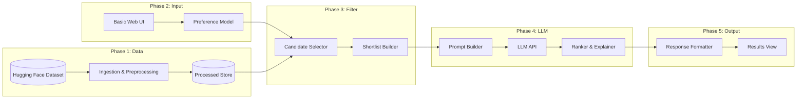
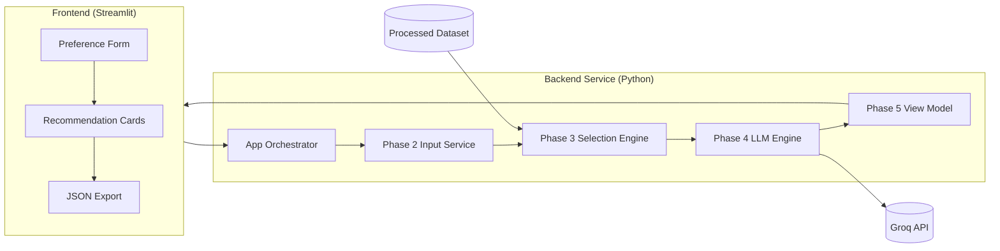
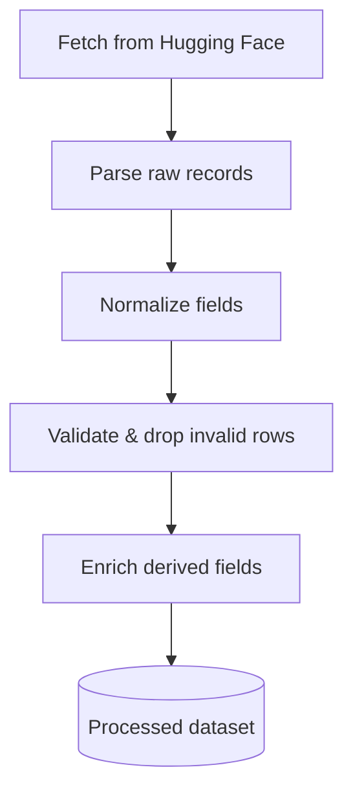
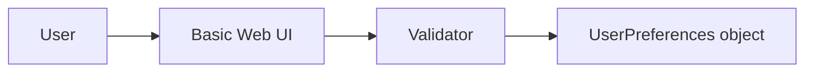
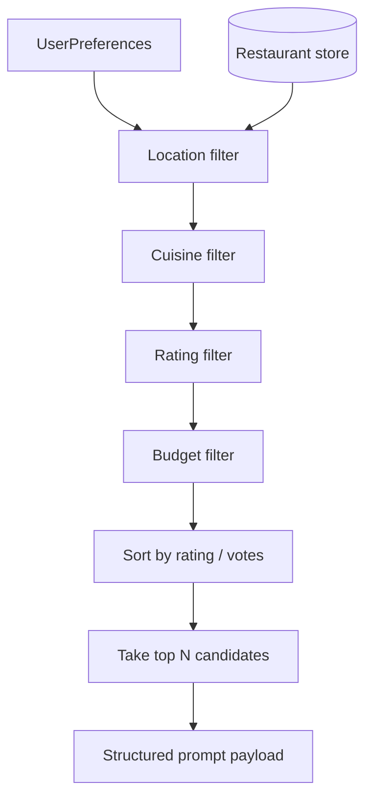
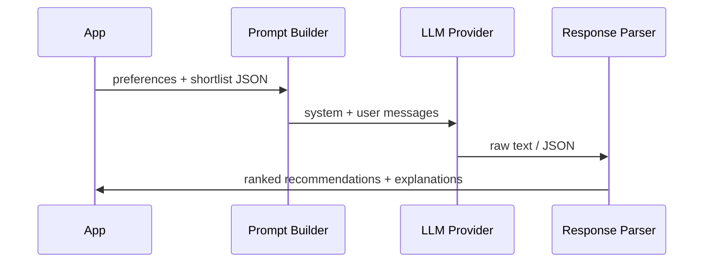
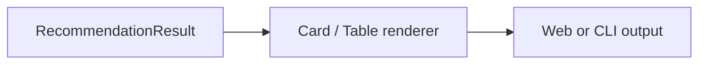
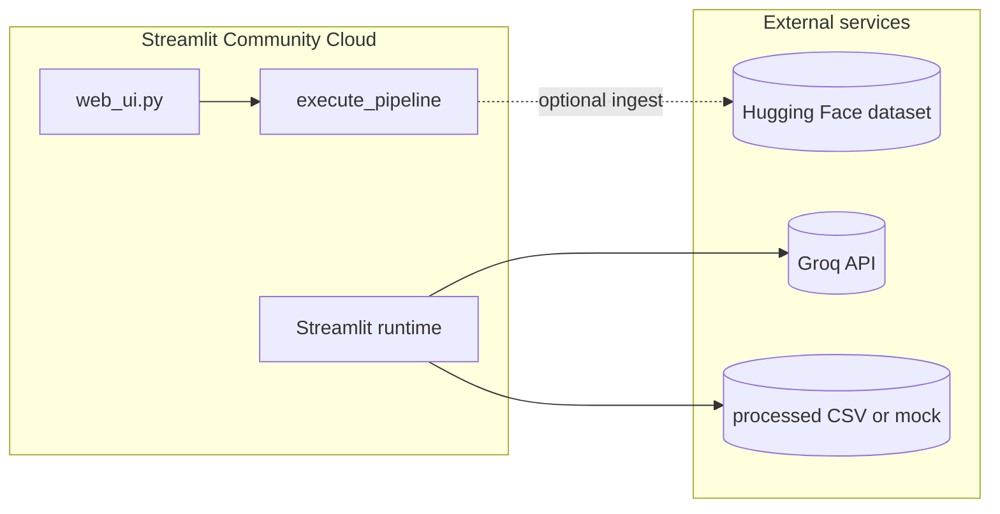

# Phase-Wise Architecture: AI-Powered Restaurant Recommendation System

This document describes the system architecture in phases, aligned with [problemstatement.md](./problemstatement.md).

---

## 1. System Overview

The application follows a **hybrid pipeline**: deterministic filtering on structured data, then LLM-based ranking and explanation on a shortlist.




### Design principles


| Principle                  | Description                                                                                       |
| -------------------------- | ------------------------------------------------------------------------------------------------- |
| **Separation of concerns** | Data, filtering, and LLM logic live in distinct modules.                                          |
| **Deterministic first**    | Hard filters (location, rating, budget) run before the LLM to reduce cost and hallucination risk. |
| **Structured LLM input**   | The model receives JSON/tabular shortlists, not the full raw dataset.                             |
| **Graceful degradation**   | If the LLM fails, return filter-based rankings with a fallback message.                           |


---

## 2. High-Level Component Map

```
┌─────────────────────────────────────────────────────────────────┐
│                        Presentation Layer                        │
│              (Basic Web UI — primary input)                      │
└────────────────────────────┬────────────────────────────────────┘
                             │
┌────────────────────────────▼────────────────────────────────────┐
│                     Application / Orchestrator                   │
│         Coordinates phases, validates input, handles errors      │
└───┬──────────────┬──────────────┬──────────────┬────────────────┘
    │              │              │              │
    ▼              ▼              ▼              ▼
┌────────┐   ┌───────────┐   ┌──────────┐   ┌─────────────┐
│ Phase 1│   │  Phase 2  │   │ Phase 3  │   │   Phase 4   │
│  Data  │   │   Input   │   │  Filter  │   │     LLM     │
└────────┘   └───────────┘   └──────────┘   └─────────────┘
                                                  │
                                                  ▼
                                            ┌─────────────┐
                                            │   Phase 5   │
                                            │   Output    │
                                            └─────────────┘
```

---

## 2.1 Post-Phase 5 Architecture (Frontend + Backend)

After completing Phase 5, the project is a two-tier application:
- **Frontend** for user interaction and visualization
- **Backend** for recommendation orchestration and domain logic



### Post-Phase-5 continuation (Phase 6+)

Detailed planning for **Phase 6 (Backend)**, **Phase 7 (Frontend)**, **Phase 8 (Interface)**, **Phase 9 (Deployment)**, and **Phase 10 (Streamlit deployment)** is defined in the main phase-wise sequence under `## 3. Phase-Wise Architecture`.

### Recommended folder split

```text
src/
├── backend/
│   ├── app.py                     # Orchestrator entry
│   ├── data/phase1/
│   ├── input/phase2/
│   ├── filters/phase3/
│   ├── llm/phase4/
│   └── models/
├── frontend/
│   ├── streamlit_app.py           # UI entry
│   └── presentation/phase5/
└── shared/
    └── contracts.py               # Request/response schemas (optional extraction)
```

> Current implementation keeps these modules under `src/` with phase folders, which is acceptable.  
> The split above is the next structural step for clearer frontend/backend boundaries.

---

## 3. Phase-Wise Architecture

### Phase 0 — Project foundation (prerequisite)

**Goal:** Establish project structure, configuration, and shared contracts before feature work.


| Item            | Detail                                                                                                                                           |
| --------------- | ------------------------------------------------------------------------------------------------------------------------------------------------ |
| **Components**  | Repo layout, environment config (`.env`), dependency management, shared types/schemas, **basic web UI (Streamlit) as the primary input surface** |
| **Outputs**     | Runnable skeleton, config for dataset path and LLM API key, web form that collects `UserPreferences`                                             |
| **Deliverable** | Empty pipeline invocable end-to-end with mocks **via the web UI** (CLI retained for dev/testing only)                                            |


**Input decision:** User preferences are collected through a **basic web UI** (Streamlit). The CLI is optional and used for automation, debugging, and tests—not the main user entry point.

**Suggested structure:**

```
src/
├── input/
│   └── phase2/         # User input defaults + validation service
├── data/              # Phase 1
├── models/            # Shared schemas (Restaurant, UserPreferences)
├── filters/           # Phase 3
├── llm/               # Phase 4 (prompt, client, parser)
├── presentation/
│   ├── web_ui.py      # Phase 0/2 — primary input + results (Streamlit)
│   └── renderer.py    # Formatting helpers
└── app.py             # Orchestrator (pipeline logic)
```

---

### Phase 1 — Data ingestion and preprocessing

**Goal:** Load the Zomato dataset, clean it, and persist a query-ready store.




#### Components


| Component          | Responsibility                                                                           |
| ------------------ | ---------------------------------------------------------------------------------------- |
| **Dataset loader** | Pull data via `datasets` library or CSV export from Hugging Face                         |
| **Field mapper**   | Map raw columns → canonical schema (`name`, `location`, `cuisines`, `cost`, `rating`, …) |
| **Cleaner**        | Handle nulls, trim strings, normalize location/cuisine casing                            |
| **Normalizer**     | Standardize budget bands (low / medium / high), numeric ratings                          |
| **Persistence**    | Save as Parquet, CSV, or in-memory DataFrame for Phase 3                                 |


#### Canonical data model

```python
Restaurant:
  id: str
  name: str
  location: str
  cuisines: list[str]
  average_cost: int | str      # normalized to band or numeric
  rating: float
  metadata: dict               # optional: votes, address, etc.
```

#### Inputs / outputs


| Input                                 | Output                                            |
| ------------------------------------- | ------------------------------------------------- |
| Hugging Face dataset URL / local file | Clean `Restaurant` collection ready for filtering |


#### Key decisions

- Run ingestion **once** (offline) vs on every app start — prefer offline for speed.
- Define explicit **budget mapping** rules (e.g., cost ≤ 300 → low).

#### Phase exit criteria

- Dataset loads without errors
- Required fields populated for ≥ 95% of records (or documented exclusions)
- Processed file reloads in < few seconds

---

### Phase 2 — User preference collection

**Goal:** Capture and validate user constraints in a structured format.




#### Components


| Component            | Responsibility                                                                             |
| -------------------- | ------------------------------------------------------------------------------------------ |
| **Input surface**    | **Basic web UI (Streamlit)** — primary; CLI for dev/tests only                             |
| **Phase 2 service**  | Build validated `UserPreferences` from raw form/CLI values                                 |
| **Validator**        | Enforce required fields, allowed enum values, rating range (Pydantic + inline form errors) |
| **Preference model** | Single object passed to Phase 3 and embedded in Phase 4 prompts                            |


#### Preference schema

```python
UserPreferences:
  location: str                  # required
  budget: Literal["low", "medium", "high"]
  cuisine: str                   # required
  min_rating: float              # e.g., 3.5
  extras: str | None             # optional free text
```

#### Inputs / outputs


| Input               | Output                      |
| ------------------- | --------------------------- |
| Web form submission | Validated `UserPreferences` |


#### Key decisions

- **Location matching:** exact city vs fuzzy (contains) — document choice in filter module.
- **Optional extras:** passed through to LLM only, not used in hard filters unless keyword rules added later.

#### Phase exit criteria

- Invalid input rejected with clear messages
- Defaults applied where sensible (e.g., `min_rating = 0`)

---

### Phase 3 — Candidate selection layer

**Goal:** Deterministically narrow the dataset to a relevant shortlist for the LLM.




#### Components


| Component              | Responsibility                                         |
| ---------------------- | ------------------------------------------------------ |
| **Filter engine**      | Chain of predicates on `Restaurant` records            |
| **Ranker (pre-LLM)**   | Sort filtered set by rating, review count, or cost fit |
| **Shortlist builder**  | Cap at N records (e.g., 10–20) to control token usage  |
| **Payload serializer** | JSON array for prompt injection                        |


#### Filter rules (example)


| Preference | Filter logic                                                |
| ---------- | ----------------------------------------------------------- |
| Location   | `restaurant.location` contains user city (case-insensitive) |
| Cuisine    | User cuisine in `restaurant.cuisines`                       |
| Min rating | `restaurant.rating >= min_rating`                           |
| Budget     | `restaurant.cost_band == user.budget`                       |


#### Inputs / outputs


| Input                                 | Output                                                    |
| ------------------------------------- | --------------------------------------------------------- |
| `UserPreferences` + processed dataset | Shortlist of 10–20 `Restaurant` objects + metadata counts |


#### Key decisions

- **Shortlist size (N):** balance LLM context vs coverage (recommended: 15).
- **Empty shortlist:** return user-facing message; do not call LLM.

#### Phase exit criteria

- Filters return correct subsets on sample queries
- Empty results handled without LLM call
- Payload fits within model context limits

---

### Phase 4 — LLM-based recommendation engine

**Goal:** Rank shortlist items and generate natural-language explanations.




#### Components


| Component            | Responsibility                                                 |
| -------------------- | -------------------------------------------------------------- |
| **Prompt templates** | System instructions + few-shot examples for consistent output  |
| **LLM client**       | Wrapper around OpenAI / Gemini / local model API               |
| **Output parser**    | Parse structured JSON or markdown into typed results           |
| **Fallback handler** | On timeout/parse error, return Phase 3 order with generic text |


#### Prompt contract (recommended)

Ask the LLM to return **structured JSON**:

```json
{
  "summary": "Brief comparison of top picks",
  "recommendations": [
    {
      "rank": 1,
      "restaurant_id": "...",
      "name": "...",
      "explanation": "Why this matches user preferences"
    }
  ]
}
```

#### Inputs / outputs


| Input                                 | Output                                           |
| ------------------------------------- | ------------------------------------------------ |
| `UserPreferences` + shortlist payload | Ranked list with explanations + optional summary |


#### Key decisions


| Topic        | Recommendation                                           |
| ------------ | -------------------------------------------------------- |
| Temperature  | Low (0.2–0.5) for stable rankings                        |
| Grounding    | Instruct model to only recommend from provided shortlist |
| Cost control | Single LLM call per user session                         |
| Caching      | Optional cache by preference hash for repeat queries     |


#### Phase exit criteria

- LLM ranks only restaurants from the shortlist
- Explanations reference user preferences (location, budget, cuisine)
- Parser handles malformed responses gracefully

---

### Phase 5 — Result presentation

**Goal:** Display recommendations in a clear, scannable format.




#### Components


| Component             | Responsibility                                                   |
| --------------------- | ---------------------------------------------------------------- |
| **View model**        | Merge LLM output with restaurant details (cuisine, cost, rating) |
| **Renderer**          | Cards in UI or formatted tables in terminal                      |
| **Export (optional)** | JSON download or copy-to-clipboard                               |


#### Display fields (per problem statement)


| Field           | Source     |
| --------------- | ---------- |
| Restaurant name | Dataset    |
| Cuisine         | Dataset    |
| Rating          | Dataset    |
| Estimated cost  | Dataset    |
| AI explanation  | LLM output |
| Rank            | LLM output |


#### Inputs / outputs


| Input                                    | Output                             |
| ---------------------------------------- | ---------------------------------- |
| Parsed LLM response + shortlist metadata | User-visible recommendation screen |


#### Phase exit criteria

- Top N results shown with all required fields
- Summary section visible when LLM provides it
- Error states (no results, LLM failure) have dedicated UI messages

---

### Phase 6 — Backend architecture consolidation

**Goal:** Establish a clear backend service boundary after Phases 1–5 are implemented.

#### Components

| Component | Responsibility |
|-----------|----------------|
| **Orchestrator (`src/app.py`)** | Coordinates all backend phases and central error handling |
| **Input service (`src/input/phase2`)** | Converts raw request payload into validated `UserPreferences` |
| **Selection service (`src/filters/phase3`)** | Deterministic filtering, ranking, and shortlist metadata |
| **LLM service (`src/llm/phase4`)** | Prompting, Groq calls, parser, and fallback flow |
| **Presentation service (`src/presentation/phase5`)** | View model preparation for frontend rendering |

#### Inputs / outputs

| Input | Output |
|-------|--------|
| Frontend request payload | `RecommendationResult` (ranked items, summary, fallback markers) |

#### Phase exit criteria

- Backend orchestration is independent from UI concerns
- Core services expose clear contracts between phases
- Failures are handled as user-safe backend responses

---

### Phase 7 — Frontend architecture consolidation

**Goal:** Define a dedicated frontend layer that consumes backend outputs cleanly.

#### Components

| Component | Responsibility |
|-----------|----------------|
| **Next.js app (`frontend/`)** | App Router UI entry; collects input and calls backend API |
| **Input UX (`PreferenceForm`)** | Form fields, inline validation messages, submit/loading states |
| **Results UX (`ResultsPanel`)** | Summary block, recommendation cards, empty/fallback banners |
| **View model (`frontend/src/lib/viewModel.ts`)** | TypeScript mirror of Phase 5 view model — sole render source |
| **API client (`frontend/src/lib/api.ts`)** | POST to Phase 6 FastAPI `/api/recommendations` |
| **Export (optional)** | JSON download from results panel |

#### Backend bridge (Phase 6 server)

| Component | Responsibility |
|-----------|----------------|
| **`src/backend/phase6/server.py`** | FastAPI app with CORS, health check, recommendations endpoint |
| **`src/backend/phase6/run_server.py`** | CLI entry: `python -m src.backend.phase6.run_server` |

#### Inputs / outputs

| Input | Output |
|-------|--------|
| Backend `RecommendationResult` (via API) | User-visible recommendation cards in Next.js |

#### Phase exit criteria

- Frontend does not embed backend business logic
- Results are rendered only via Phase 5 view model (TypeScript equivalent)
- UI states (loading, empty, fallback) are handled explicitly

#### UI design prompt (Google Stitch + Next.js)

A copy-paste prompt for generating frontend mockups with Google Stitch is documented in [google-stitch-frontend-prompt.md](./google-stitch-frontend-prompt.md). It covers:

- Target stack: **Next.js** (App Router), TypeScript, Tailwind CSS
- Screens: form, loading, results, empty, fallback, validation error, mobile
- Sample data and API contract shapes for realistic placeholders
- Brand direction aligned with Zomato-inspired food discovery

---

### Phase 8 — Frontend-backend interface contract

**Goal:** Standardize request/response contracts between frontend and backend.

#### Contract sections

| Contract | Description |
|----------|-------------|
| **Request contract** | Normalized preference payload (`location`, `budget`, `cuisine`, `min_rating`, `extras`) |
| **Response contract** | `RecommendationResult` with ranked items, summary, fallback, counts |
| **Error contract** | Human-readable validation and runtime error messages |

#### Interface behavior

- Frontend sends validated preferences only
- Backend returns deterministic shape regardless of fallback path
- LLM failures degrade gracefully and preserve output schema

#### Phase exit criteria

- Contract is stable and documented → [phase8-api-contract.md](./phase8-api-contract.md)
- Frontend/backend can evolve independently behind the contract
- Regression tests cover request/response compatibility (`tests/phase8/`, `frontend/src/lib/contract.test.ts`)

#### Implementation artifacts

| Artifact | Path |
|----------|------|
| Contract manifest (`GET /api/contract`) | `src/backend/phase8/manifest.py` |
| Request validation | `src/backend/phase8/validate.py` |
| TypeScript guards | `frontend/src/lib/contract.ts` |
| Shared fixtures | `contracts/v1/fixtures/` |
| Schema export | `python -m src.backend.phase8.export` |

---

### Phase 9 — Deployment architecture (target)

**Goal:** Define deployable topology for production-like usage (split services).

#### Deployment model

| Layer | Current | Target |
|-------|---------|--------|
| **Frontend** | Next.js dev server (`frontend/`) | Static/SSR host (e.g., Vercel, Netlify) |
| **Backend** | FastAPI (`src/backend/phase6/`) | Managed API service (e.g., Render, Fly.io) |
| **Legacy UI** | Streamlit (`src/presentation/web_ui.py`) | Optional; see **Phase 10** for all-in-one Streamlit hosting |
| **Data** | Local processed CSV | Bundled sample, build-time ingest, or external store |
| **LLM** | Groq API via backend service | Same, with key management and monitoring |

#### Operational concerns

- Secrets in environment variables only (never committed)
- `CORS_ORIGINS` on backend must include the production frontend origin
- `NEXT_PUBLIC_API_URL` on frontend must point to the deployed API base URL
- Structured logging for filter/LLM performance
- Health checks (`GET /health`) and timeout/fallback monitoring
- Optional caching for repeated preference queries

#### Phase exit criteria

- Next.js frontend and FastAPI backend are deployable as separate services
- Environment-based configuration supports dev/staging/prod
- Reliability targets are met under Groq/API/network failures

---

### Phase 10 — Streamlit deployment (free hosting)

**Goal:** Publish the legacy **all-in-one** Streamlit app (`src/presentation/web_ui.py`) to a free host without running a separate Next.js or FastAPI process. Suitable for demos, milestones, and quick sharing when the full two-tier stack is not required.

#### Why a separate phase

| Aspect | Phase 9 (split stack) | Phase 10 (Streamlit) |
|--------|------------------------|----------------------|
| **Processes** | Next.js + FastAPI (2 services) | Single Streamlit process |
| **UI entry** | `frontend/` | `src/presentation/web_ui.py` |
| **Pipeline** | HTTP API → `run_backend_request` | In-process `execute_pipeline` |
| **Primary free host** | Vercel + Render | [Streamlit Community Cloud](https://streamlit.io/cloud) |
| **Best for** | Production-like portfolio | Fast deploy, classroom demos |



#### Components

| Component | Responsibility |
|-----------|----------------|
| **`src/presentation/web_ui.py`** | App entry: form, sidebar mock toggle, results via Phase 5 view model |
| **`requirements.txt`** | Must include `streamlit`, `pandas`, `fastapi` deps used by pipeline |
| **`.streamlit/config.toml`** (optional) | Theme, server headless defaults for cloud |
| **Secrets / env** | `LLM_API_KEY`, `LLM_PROVIDER`, `PROCESSED_DATA_PATH`, budget/shortlist vars |
| **Repository layout** | Streamlit Cloud main file: `streamlit_app.py` (root); UI in `src/presentation/web_ui.py` |

#### Recommended free hosting

| Platform | Cost | Notes |
|----------|------|--------|
| **Streamlit Community Cloud** | Free (public repos) | Connect GitHub → set main file → add secrets in dashboard |
| **Render** (optional) | Free tier | Web service with start command `streamlit run src/presentation/web_ui.py --server.port=$PORT --server.address=0.0.0.0` |
| **Hugging Face Spaces** (optional) | Free | Docker + Streamlit if Community Cloud limits apply |

#### Configuration (Streamlit Cloud)

1. Push project to a **public** GitHub repo (or use Streamlit Teams for private).
2. **Main file path:** `streamlit_app.py` (at repository root)
3. **Python version:** 3.10+ (match local venv).
4. **Secrets** (Streamlit Cloud → Settings → Secrets), mirroring `.env`:

```toml
LLM_PROVIDER = "groq"
LLM_API_KEY = "your-groq-key"
PROCESSED_DATA_PATH = "data/processed/restaurants.csv"
SHORTLIST_SIZE = "15"
DISPLAY_TOP_K = "5"
```

5. For demos without a large dataset, enable **Use mock dataset** in the sidebar or set `LLM_PROVIDER=mock` and ship a small CSV / rely on mock path in `execute_pipeline`.

#### Data constraints on free tiers

- Full processed CSV (~640 MB) is **too large** for typical Git pushes and slow on cold start.
- **Recommended for Phase 10:**
  - Commit a **small sample** `data/processed/restaurants_sample.csv` and set `PROCESSED_DATA_PATH` in secrets, or
  - Use sidebar **mock data** for public demos, or
  - Run Phase 1 ingestion in a **one-off build step** (longer deploy; requires Hugging Face access at build time).

#### Deploy steps (Streamlit Community Cloud)

```bash
# Local smoke test before cloud deploy
streamlit run src/presentation/web_ui.py
```

1. Ensure `streamlit` is listed in `requirements.txt`.
2. Add `.streamlit/config.toml` if custom theme or `headless = true` is needed.
3. Connect repo on [share.streamlit.io](https://share.streamlit.io).
4. Set main file to `streamlit_app.py`.
5. Add secrets; redeploy.
6. Share the generated `*.streamlit.app` URL.

#### Inputs / outputs

| Input | Output |
|-------|--------|
| User form in Streamlit | Rendered recommendation cards (Phase 5 view model) in-browser |
| Optional `use_mock_data` checkbox | Same pipeline with in-memory sample restaurants |

#### Phase exit criteria

- App runs on Streamlit Community Cloud (or equivalent) with a public URL
- Groq (or mock) recommendations work end-to-end without local `localhost`
- Secrets are configured only in the host dashboard (not in git)
- README documents the Streamlit deploy path alongside the Next.js + FastAPI path (Phase 9)

#### Relationship to Phase 9

- **Phase 9** — split **Next.js + FastAPI** production topology.
- **Phase 10** — **Streamlit-only** shortcut; does not replace Phase 9 but gives a zero-cost, single-service alternative using existing `web_ui.py`.

---

## 4. End-to-End Data Flow

```
User
  │
  ▼
[Phase 2] UserPreferences
  │
  ▼
[Phase 3] Filter(processed_data, preferences) → shortlist[N]
  │
  ▼
[Phase 4] prompt(preferences, shortlist) → LLM → RecommendationResult
  │
  ▼
[Phase 5] render(RecommendationResult, shortlist) → UI
```

**Phase 1** runs offline or at startup: `Hugging Face → processed_data`.

---

## 4.1 Runtime Request Flows (Current)

**Next.js + FastAPI (Phase 7 / 9 target):**

```text
Next.js PreferenceForm submit
  -> POST /api/recommendations (Phase 6 FastAPI)
  -> run_backend_request() / execute_pipeline
  -> Phase 1 load_restaurants()
  -> Phase 3 build_shortlist_with_metadata()
  -> Phase 4 generate_recommendations() [Groq + fallback]
  -> Phase 5 view model -> JSON response
  -> frontend ResultsPanel render
```

**Streamlit all-in-one (Phase 10 deploy path):**

```text
Streamlit form submit (web_ui.py)
  -> execute_pipeline(preferences)
  -> Phase 1 load_restaurants()
  -> Phase 3 build_shortlist_with_metadata()
  -> Phase 4 generate_recommendations() [Groq + fallback]
  -> Phase 5 build_phase5_view_model()
  -> Streamlit render cards
```

---

## 5. Cross-Cutting Concerns


| Concern            | Approach                                                               |
| ------------------ | ---------------------------------------------------------------------- |
| **Configuration**  | Central `config.py` / `.env` for dataset path, LLM key, shortlist size |
| **Logging**        | Log filter counts, LLM latency, parse failures                         |
| **Error handling** | User-friendly messages; never expose API keys                          |
| **Testing**        | Unit tests for filters; mock LLM for integration tests                 |
| **Security**       | API keys in environment only; validate all user input                  |


---

## 6. Suggested Technology Stack


| Layer    | Options                                     |
| -------- | ------------------------------------------- |
| Language | Python 3.10+                                |
| Data     | `pandas`, `datasets` (Hugging Face)         |
| UI       | Next.js (primary, Phase 7) / Streamlit (legacy, Phase 10) |
| API      | FastAPI + uvicorn (Phase 6/9)               |
| Deploy   | Vercel + Render (Phase 9); Streamlit Community Cloud (Phase 10) |
| LLM      | **Groq** (current), OpenAI, Gemini, Ollama  |
| Config   | `python-dotenv` / Streamlit secrets         |


Stack choice is flexible; phases and boundaries stay the same.

---

## 7. Implementation Roadmap


| Phase | Focus | Depends on |
|------|-------|------------|
| 0 | Project setup, schemas, config, basic web UI | — |
| 1 | Dataset load, clean, persist | 0 |
| 2 | Web form polish + validation | 0 |
| 3 | Filter engine + shortlist | 1, 2 |
| 4 | Prompt design + LLM integration (Groq) | 3 |
| 5 | Result view-model and renderer polish | 4 |
| 6 | Backend architecture consolidation | 5 |
| 7 | Frontend architecture consolidation (Next.js) | 5, 6 |
| 8 | Frontend-backend interface contract | 6, 7 |
| 9 | Deployment architecture (Next.js + FastAPI, env tiers, ops) | 8 |
| 10 | Streamlit deployment (Community Cloud / free single-service host) | 5, 9 |


---

## 8. Non-Functional Requirements


| Requirement     | Target                                                         |
| --------------- | -------------------------------------------------------------- |
| Response time   | < 10s including LLM (depends on provider)                      |
| Reliability     | Usable results even if LLM fails (fallback to Phase 3 ranking) |
| Maintainability | Each phase in its own module with clear interfaces             |
| Scalability     | Phase 1 offline; Phases 2–5 stateless per request              |


---

## 9. Reference

- Problem statement: [problemstatement.md](./problemstatement.md)
- Google Stitch UI prompt (Next.js): [google-stitch-frontend-prompt.md](./google-stitch-frontend-prompt.md)
- Dataset: [ManikaSaini/zomato-restaurant-recommendation](https://huggingface.co/datasets/ManikaSaini/zomato-restaurant-recommendation)

