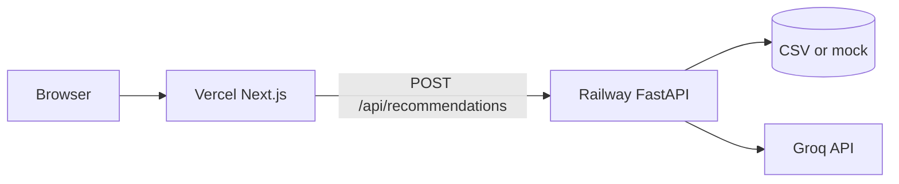

# Deployment plan: Railway (backend) + Vercel (frontend)

Production stack for this project:

| Service | Platform | Code |
|---------|----------|------|
| **Frontend** | [Vercel](https://vercel.com) | `frontend/` (Next.js 14) |
| **Backend API** | [Railway](https://railway.com) | `src/backend/phase6/` (FastAPI) |
| **LLM** | Groq (external) | API key on Railway only |

Repository: [Milestone-1---Zomato](https://github.com/dhulipudialekhya-nextleap/Milestone-1---Zomato)

---

## Architecture (deployed)



---

## Prerequisites

1. GitHub repo pushed and connected to Railway and Vercel.
2. [Groq API key](https://console.groq.com) for live recommendations (or use `LLM_PROVIDER=mock` for demos).
3. **Data strategy** (pick one):
   - **Demo (recommended):** `NEXT_PUBLIC_USE_MOCK=true` on Vercel, or `use_mock_data: true` in API requests.
   - **Small sample CSV:** Commit `data/processed/restaurants_sample.csv` (&lt; 100 MB) and set `PROCESSED_DATA_PATH`.
   - **Build-time ingest:** Railway build runs Phase 1 ingestion (slow; needs Hugging Face access).

The full ~640 MB `restaurants.csv` is **gitignored** and must not be pushed to GitHub.

---

## Part 1 — Backend on Railway

### 1.1 Create service

1. Go to [railway.com](https://railway.com) → **New Project**.
2. **Deploy from GitHub repo** → select **Milestone-1---Zomato** → branch **`main`**.
3. Railway auto-detects Python. Confirm settings:

| Setting | Value |
|---------|--------|
| **Root directory** | *(repo root)* |
| **Builder** | Dockerfile (auto from repo) |
| **Build command** | *(leave empty)* |
| **Start command** | *(leave empty — uses Dockerfile `CMD`)* |

Repo includes [`railway.toml`](../railway.toml) + [`Dockerfile`](../Dockerfile) (Docker build — no custom pip command).  
Copy variables from [`railway.env.example`](../railway.env.example) into Railway → **Variables**.

4. **Settings → Networking → Generate Domain** to get a public URL like:
   `https://zomato-api-production.up.railway.app`

### 1.2 Environment variables (Railway)

In your service → **Variables**:

| Key | Example | Notes |
|-----|---------|--------|
| `LLM_PROVIDER` | `groq` | Use `mock` for demo without API key |
| `LLM_API_KEY` | `gsk_...` | Required when `LLM_PROVIDER=groq` |
| `LLM_MODEL` | `llama-3.1-8b-instant` | Groq model id |
| `CORS_ORIGINS` | `https://your-app.vercel.app` | **Optional** — `*.vercel.app` already allowed |
| `LOG_LEVEL` | `INFO` | |
| `SHORTLIST_SIZE` | `15` | |
| `DISPLAY_TOP_K` | `5` | |
| `DISABLE_DATA_INGEST` | `true` | Skip HF ingest when no CSV (recommended on Railway) |
| `PROCESSED_DATA_PATH` | `data/processed/restaurants_sample.csv` | Only if you ship sample data |

Railway sets `RAILWAY_ENVIRONMENT` automatically; the app skips auto-ingest when running on Railway.

After Vercel deploy, you may add `CORS_ORIGINS` (optional). If redeploy fails, remove it — standard Vercel URLs work without it.

### 1.3 Verify backend

```bash
curl https://YOUR-SERVICE.up.railway.app/health
# {"status":"ok"}

curl https://YOUR-SERVICE.up.railway.app/api/contract
# Phase 8 manifest JSON
```

Test recommendations (mock):

```bash
curl -X POST https://YOUR-SERVICE.up.railway.app/api/recommendations \
  -H "Content-Type: application/json" \
  -d "{\"location\":\"Koramangala\",\"budget\":\"medium\",\"cuisine\":\"Italian\",\"min_rating\":4.0,\"use_mock_data\":true}"
```

---

## Part 2 — Frontend on Vercel

### 2.1 Import project

1. [Vercel Dashboard](https://vercel.com) → **Add New** → **Project**.
2. Import **Milestone-1---Zomato** from GitHub.
3. Configure:

| Setting | Value |
|---------|--------|
| **Framework preset** | Next.js |
| **Root directory** | **`frontend`** |
| **Build command** | `npm run build` |

> **No Next.js detected:** set Root Directory to **`frontend`**.  
> **FastAPI / `src/app.py` error:** backend is on **Railway**, not Vercel — set Root Directory = `frontend`.

Repo-root [`vercel.json`](../vercel.json) includes `"rootDirectory": "frontend"`.

### 2.2 Environment variables (Vercel)

| Key | Value |
|-----|--------|
| `NEXT_PUBLIC_API_URL` | `https://YOUR-SERVICE.up.railway.app` |

No trailing slash. Redeploy after changing.

Optional for demo without CSV on Railway:

| Key | Value |
|-----|--------|
| `NEXT_PUBLIC_USE_MOCK` | `true` |

### 2.3 Verify frontend

1. Open `https://your-project.vercel.app`.
2. Submit preferences → recommendations load.
3. If CORS errors: set `CORS_ORIGINS` on Railway to your exact Vercel origin.

---

## Part 3 — Deploy order (checklist)

| Step | Action |
|------|--------|
| 1 | Deploy **Railway** backend; generate public domain |
| 2 | `curl` `/health` and sample `POST /api/recommendations` |
| 3 | Deploy **Vercel** with `NEXT_PUBLIC_API_URL` = Railway URL |
| 4 | *(Optional)* Set Railway `CORS_ORIGINS` to Vercel URL |
| 5 | End-to-end test from browser |

---

## Part 4 — Local parity

**Backend:**

```bash
python -m src.backend.phase6.run_server
# http://localhost:8000
```

**Frontend:**

```bash
cd frontend
# .env.local: NEXT_PUBLIC_API_URL=http://localhost:8000
npm run dev
# http://localhost:3000
```

---

## Part 5 — Troubleshooting

| Symptom | Likely cause | Fix |
|---------|----------------|-----|
| CORS error in browser | Custom domain not allowed | Add exact origin to `CORS_ORIGINS` (no trailing `/`) |
| Railway redeploy fails after Step 3 | Bad env value or health timeout | Remove `CORS_ORIGINS`; verify `SHORTLIST_SIZE=15`, `DISPLAY_TOP_K=5`; redeploy |
| `Failed to fetch` | Wrong `NEXT_PUBLIC_API_URL` | Point to Railway HTTPS URL |
| Empty recommendations | No CSV + mock off | `NEXT_PUBLIC_USE_MOCK=true` |
| Groq errors | Missing/invalid key | Set `LLM_API_KEY` on Railway |
| Build fails on Vercel | Wrong root | Root directory = `frontend` |
| Railway build/deploy fails | Custom build command or heavy Nixpacks deps | Clear **Build** + **Start** commands in Railway UI; redeploy latest `main` (uses `Dockerfile`) |

---

## Part 6 — Security

- Never commit `.env`, `.env.local`, or API keys.
- Groq key only on **Railway** (server).
- `NEXT_PUBLIC_*` vars are visible in the browser — URLs/flags only.

---

## Related docs

- [architecture.md](./architecture.md) — Phase 9 deployment
- [phase8-api-contract.md](./phase8-api-contract.md) — API shapes
