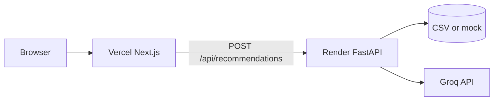

# Deployment plan: Render (backend) + Vercel (frontend)

Production stack for this project:

| Service | Platform | Code |
|---------|----------|------|
| **Frontend** | [Vercel](https://vercel.com) | `frontend/` (Next.js 14) |
| **Backend API** | [Render](https://render.com) | `src/backend/phase6/` (FastAPI) |
| **LLM** | Groq (external) | API key on Render only |

Repository: [Milestone-1---Zomato](https://github.com/dhulipudialekhya-nextleap/Milestone-1---Zomato)

---

## Architecture (deployed)



---

## Prerequisites

1. GitHub repo pushed and connected to both platforms.
2. [Groq API key](https://console.groq.com) for live recommendations (or use `LLM_PROVIDER=mock` for demos).
3. **Data strategy** (pick one):
   - **Demo (recommended):** API requests with `use_mock_data: true` from frontend, or set backend to always use mock in code for public demo.
   - **Small sample CSV:** Commit `data/processed/restaurants_sample.csv` (&lt; 100 MB) and set `PROCESSED_DATA_PATH`.
   - **Build-time ingest:** Render build command runs Phase 1 ingestion (slow; needs Hugging Face access).

The full ~640 MB `restaurants.csv` is **gitignored** and must not be pushed to GitHub.

---

## Part 1 — Backend on Render

### 1.1 Create Web Service

1. [Render Dashboard](https://dashboard.render.com) → **New** → **Web Service**.
2. Connect **Milestone-1---Zomato** → branch **`main`**.
3. Settings:

| Setting | Value |
|---------|--------|
| **Name** | `zomato-api` (or your choice) |
| **Root directory** | *(leave empty — repo root)* |
| **Runtime** | Python 3 |
| **Build command** | `pip install -r requirements.txt` |
| **Start command** | `uvicorn src.backend.phase6.server:app --host 0.0.0.0 --port $PORT` |

Optional: use the repo file [`render.yaml`](../render.yaml) with **Blueprint** deploy for repeatable setup.

### 1.2 Environment variables (Render)

Set in **Environment** tab:

| Key | Example | Notes |
|-----|---------|--------|
| `LLM_PROVIDER` | `groq` | Use `mock` for demo without API key |
| `LLM_API_KEY` | `gsk_...` | Required when `LLM_PROVIDER=groq` |
| `LLM_MODEL` | `llama-3.1-8b-instant` | Groq model id |
| `CORS_ORIGINS` | `https://your-app.vercel.app` | **Required** — your Vercel URL (no trailing slash) |
| `LOG_LEVEL` | `INFO` | |
| `SHORTLIST_SIZE` | `15` | |
| `DISPLAY_TOP_K` | `5` | |
| `PROCESSED_DATA_PATH` | `data/processed/restaurants_sample.csv` | Only if you ship sample data |

After the first Vercel deploy, update `CORS_ORIGINS` with the real Vercel domain and redeploy Render.

### 1.3 Verify backend

```bash
curl https://YOUR-RENDER-SERVICE.onrender.com/health
# {"status":"ok"}

curl https://YOUR-RENDER-SERVICE.onrender.com/api/contract
# Phase 8 manifest JSON
```

Test recommendations (mock):

```bash
curl -X POST https://YOUR-RENDER-SERVICE.onrender.com/api/recommendations \
  -H "Content-Type: application/json" \
  -d "{\"location\":\"Koramangala\",\"budget\":\"medium\",\"cuisine\":\"Italian\",\"min_rating\":4.0,\"use_mock_data\":true}"
```

**Free tier note:** Render sleeps after inactivity; first request may take 30–60+ seconds.

---

## Part 2 — Frontend on Vercel

### 2.1 Import project

1. [Vercel Dashboard](https://vercel.com) → **Add New** → **Project**.
2. Import **Milestone-1---Zomato** from GitHub.
3. Configure:

| Setting | Value |
|---------|--------|
| **Framework preset** | Next.js |
| **Root directory** | **`frontend`** ← required (must contain `package.json` with `next`) |
| **Build command** | `npm run build` (default when root is `frontend`) |
| **Output** | Next.js default |

> **If you see:** `No Next.js version detected`  
> Vercel is reading the **repo root** `package.json` (no `next`) instead of `frontend/package.json`.  
> Fix: set **Root Directory** to **`frontend`**, or use repo-root [`vercel.json`](../vercel.json) with `"rootDirectory": "frontend"`.  
> Do **not** add a root `package.json` without `next` in dependencies.

> **If you see:** `Found src/app.py but it does not define a top-level "app" FastAPI instance`  
> Vercel is building the **Python repo root** instead of Next.js. Fix: set **Root Directory** to `frontend` and redeploy.  
> Do **not** add the suggested `pyproject.toml` FastAPI entrypoint — the API runs on **Render**, not Vercel.

**Alternative:** leave Root Directory empty — repo-root [`vercel.json`](../vercel.json) and [`.vercelignore`](../.vercelignore) build only `frontend/` and exclude Python.

**Redeploy after fix:** Vercel → **Deployments** → latest → **⋯** → **Redeploy**, or push to `main` (auto-deploy if GitHub is connected).

### 2.2 Environment variables (Vercel)

| Key | Value |
|-----|--------|
| `NEXT_PUBLIC_API_URL` | `https://YOUR-RENDER-SERVICE.onrender.com` |

No trailing slash. Redeploy after changing.

Optional for public demo without real CSV on Render:

| Key | Value |
|-----|--------|
| `NEXT_PUBLIC_USE_MOCK` | `true` |

This sets `use_mock_data` on API requests from [`HomePage.tsx`](../frontend/src/components/HomePage.tsx).

### 2.3 Verify frontend

1. Open `https://your-project.vercel.app`.
2. Submit preferences → recommendations load.
3. If CORS errors: fix `CORS_ORIGINS` on Render to match exact Vercel origin (including `https://`).

---

## Part 3 — Deploy order (checklist)

| Step | Action |
|------|--------|
| 1 | Deploy **Render** backend; note API URL |
| 2 | `curl` `/health` and sample `POST /api/recommendations` |
| 3 | Deploy **Vercel** with `NEXT_PUBLIC_API_URL` |
| 4 | Set Render `CORS_ORIGINS` to Vercel URL; redeploy Render |
| 5 | End-to-end test from browser |

---

## Part 4 — Local parity

**Backend:**

```bash
python -m src.backend.phase6.run_server
# http://localhost:8000
```

**Frontend:**

```bash
cd frontend
# .env.local: NEXT_PUBLIC_API_URL=http://localhost:8000
npm run dev
# http://localhost:3000
```

Contract reference: [phase8-api-contract.md](./phase8-api-contract.md)

---

## Part 5 — Troubleshooting

| Symptom | Likely cause | Fix |
|---------|----------------|-----|
| CORS error in browser | `CORS_ORIGINS` missing Vercel URL | Add exact origin on Render |
| `Failed to fetch` / network | Wrong `NEXT_PUBLIC_API_URL` | Point to Render HTTPS URL |
| 502 / timeout on first hit | Render cold start | Wait and retry; upgrade plan or use keep-warm |
| Empty recommendations | No CSV + mock off | `NEXT_PUBLIC_USE_MOCK=true` or ingest sample data |
| Groq errors | Missing/invalid key | Set `LLM_API_KEY` on Render |
| Build fails on Vercel | Wrong root | Root directory must be `frontend` |
| FastAPI / `src/app.py` error on Vercel | Vercel detected Python backend | Set Root Directory = `frontend`; backend is on Render only |
| No Next.js version detected | Root Directory not `frontend` | Set Root Directory = `frontend`; remove root `package.json` without `next` |

---

## Part 6 — Security

- Never commit `.env`, `.env.local`, or API keys.
- Groq key only on **Render** (server).
- `NEXT_PUBLIC_*` vars are visible in the browser — only non-secret URLs/flags.

---

## Related docs

- [architecture.md](./architecture.md) — Phase 9 deployment architecture
- [phase8-api-contract.md](./phase8-api-contract.md) — API request/response shapes
